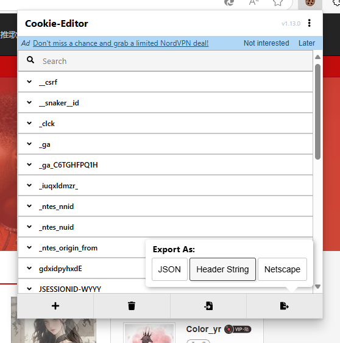

<div align="center">


</div>


**This project only can use in china main land**  
**Chinese only**


注：需要配合[客户端Mod](https://github.com/Coloryr/AllMusic_Client)使用  
**不兼容旧版客户端Mod，需要新版客户端Mod**

## 下载
登录github账户  
跳转到action中下载

插件支持的服务器
- CatServer(LoliServer)
- Spigot(CraftBukkit)
- Paper
- Folia
- Bungeecord
- Velocity

兼容但未测试服务器
- KCauldron
- Uranium
- Thermos

模组支持的服务器
- Forge(<1.20.1)
- NeoForge(>=1.20.4)
- Fabric(>=1.16.5)

## 使用方法
1. 安装AllMusic_Server

Bukkit/Folia类服务器  
复制`[bukkit_spigot_paper]AllMusic_Server-xxx-all.jar`到你的`plugins`文件夹  
Bungeecord/Velocity类服务器  
复制`[bungeecord_velocity]AllMusic_Server-xxx-all.jar`到你的`plugins`文件夹  
Forge/Fabric/NeoForge类服务器  
复制`[xxx-xxx]AllMusic_Server-xxx-all.jar`到你的`mods`文件夹  

2. 安装[客户端mod](https://github.com/Coloryr/AllMusic_Client)  
复制`[xxx-xxx]AllMusic_Client-3.0.0`到客户端的`mods`文件夹
重启客户端

## 播放VIP歌曲
1. 手机号创建网易云账户并购买网易云音乐VIP
2. 在配置文件给自己管理员然后/music reload
   - bukkit/spigot/paper/folia 服务器给自己op是同样的效果
   - forge/fabric/neoforge 服务器给自己等级权限2是同样的效果
   - bc/velocity 需要配置文件写上自己的游戏名\
3. 使用支持安装插件的浏览器，打开music.163.com登录账户
4. 给浏览器安装插件 https://cookie-editor.com/
5. 打开插件，然后复制cookie

6. 在控制台输入/music cookie 你复制出来的内容

如果登录失效，请删除`cookie.json`再打`/music reload`再重新登录

## PAPI变量  
> %allmusic_now_music_name% 歌曲名字  
> %allmusic_now_music_al% 歌曲专辑  
> %allmusic_now_music_alia% 歌曲原曲  
> %allmusic_now_music_author% 歌曲作者  
> %allmusic_now_music_call% 点歌人  
> %allmusic_now_music_info% 歌曲所有信息  
> %allmusic_list_size% 队列大小  
> %allmusic_music_list% 队列歌曲  
> %allmusic_lyric% 歌词  
> %allmusic_tlyric% 翻译的歌词
> %allmusic_klyric% KTV歌词  

## 更新日志

```
3.0.0：将插件大部分重写
3.1.0：添加文本长度限制
3.1.1：调整配置文件
3.1.4：修改语言文件
3.1.5：修复名字判断问题
3.1.6：修复点歌问题
3.1.7：修复群组服通信问题
3.1.8：修复错误的初始化顺序
3.1.9：修复进服崩服问题
3.2.0：调整语言文件
3.2.1：修复切歌点歌问题
3.2.2：修复群组服通信问题
3.2.3：添加新版网易云链接解析
3.2.4：调整打包的依赖
```

## 配置文件说明
配置文件采用json格式，需要遵守json编写的格式规范  
- maxPlayList              最大歌曲数  
- maxPlayerList            一个玩家最大可点数量，0代表不限制
- minVote                  最小通过投票数
- voteTime                 投票时间
- lyricDelay               歌曲延迟，单位毫秒
- defaultAddMusic          默认添加歌曲方式，1为搜歌
- ktvLyricDelay            KTV模式歌词延迟，单位毫秒
- adminList                管理员列表
- muteServer               不参与点歌的服务器列表
- mutePlayer               不参与点歌的玩家列表
- banMusic                 禁止点歌ID列表，ID为音乐ID
- banPlayer                禁止玩家点歌列表
- playListSwitch           是否玩家点歌后是否直接从空闲歌单切换至玩家歌曲
- playListRandom           是否空闲歌单随机播放
- sendLyric                是否发送歌词到客户端
- needPermission           是否指令需要权限
- topPAPI                  是否启用顶层模式，用于和BC交换数据
- mutePlayMessage          是否不发送播放信息
- muteAddMessage           是否不发送点歌信息
- showInBar                是否将信息限制在bar处
- ktvMode                  是否启用KTV歌词
- musicBR                  歌曲音质
- version                  配置文件版本号
- defaultHud               默认Hud配置
    - list                 播放列表Hud配置
        - x                x轴间距
        - y                y轴间距
        - dir              对齐方式
        - color            字体颜色
        - shadow           是否显示字体阴影
        - enable           是否启用
    - lyric                歌词Hud配置
        - x
        - y
        - dir  
        - color 
        - shadow 
        - enable 
    - info                 歌曲信息Hud配置
        - x
        - y
        - dir
        - color
        - shadow
        - enable
    - pic                  图片显示配置
        - x
        - y
        - dir
        - color            图片尺寸
        - shadow           是否开启图片旋转
        - enable
    - picRotateSpeed       图片旋转速度
- economy                  经济扩展配置
    - mysqlUrl             目前无用
    - backend              目前无用
    - vault                是否使用vault插件
- funConfig                娱乐选项
    - rain                 是否启用随机下雨
    - rainRate             随机下雨概率
- limit                    限制设置
    - messageLimit         是否启用广播消息长度限制
    - messageLimitSize     广播消息限制长度
    - listLimit            是否启用歌曲列表长度限制
    - listLimitSize        歌曲列表限制长度
    - infoLimit            是否启用信息长度限制
    - infoLimitSize        信息长限制长度
    - musicTimeLimit       是否启用歌曲长度限制
    - maxMusicTime         限制最长歌曲长度，单位秒
    - limitText            限制长度替换文本
- cost                     花费相关配置
    - searchCost           搜歌花费
    - addMusicCost         点歌花费
    - useCost              启用花费
- sendDelay                Hud信息更新延迟

## 指令说明
普通玩家指令  
- /music [音乐ID/网易云分享链接] 点歌
- /music stop 停止播放歌曲
- /music list 查看歌曲队列
- /music cancel (序号) 取消你的点歌
- /music vote 投票切歌
- /music vote cancel 取消发起的切歌
- /music push (序号) 投票将歌曲插入到队列头
- /music push cancel 取消发起的插歌
- /music mute 不再参与点歌
- /music search [歌名] 搜索歌曲
- /music select [序列] 选择歌曲
- /music nextpage 切换下一页歌曲搜索结果
- /music lastpage 切换上一页歌曲搜索结果
- /music hud enable 启用/关闭全部界面
- /music hud reset 重置全部界面
- /music hud [位置] enable 启用关闭单一界面
- /music hud [位置] pos [x] [y] 设置某个界面的位置
- /music hud [位置] dir [对齐方式] 设置某个界面的对齐方式
- /music hud [位置] color [颜色HEX] 设置某个界面的颜色
- /music hud [位置] reset 重置单一界面
- /music hud pic size [尺寸] 设置图片尺寸
- /music hud pic rotate [开关] 设置图片旋转模式
- /music hud pic speed [数值] 设置图片旋转速度

管理员指令
以下方式才是管理员
   - 在配置文件给自己管理员然后/music reload
   - bukkit/spigot/paper/folia 服务器给自己op
   - forge/fabric/neoforge 服务器给自己等级权限2
   - bc/velocity 配置文件写上自己的游戏名
- /music reload 重读配置文件
- /music next 强制切歌
- /music ban [ID] 禁止点这首歌
- /music banplayer [ID] 禁止某位玩家点歌
- /music url [url] 播放一首自定义歌曲
- /music delete [序号] 删除队列中的歌曲
- /music addlist [歌单ID] 添加歌单到空闲列表
- /music clearlist 清空空闲歌单
- /music cookie [Cookie] 填写网页Cookie并尝试登录

若开启权限后  
- 点歌需要权限`allmusic.addmusic`
- 搜歌需要权限`allmusic.search`
- 插歌需要权限`allmusic.push`
- 投票切歌需要权限`allmusic.vote`
